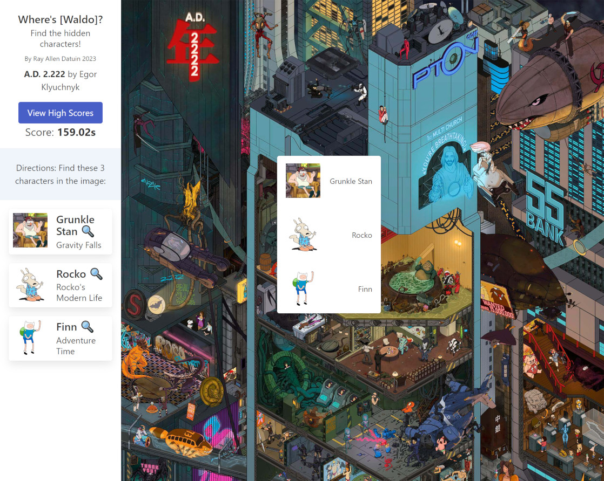

# Where's Waldo (A Photo Tagging App)

For the Odin Project. This is a game where the user attempts to correctly identify three characters on a large map image. The user is timed and can submit thier time to a high score list.

## Tech Stack

Vite, React, BulmaCSS, Firebase

## Screenshots

## Acknowledgements

Egor Klyuchnyk - https://chekavo.artstation.com/ - Artist of A.D. 2.222